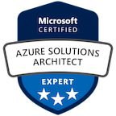
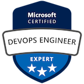
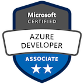

Hello. My name is Michael Rice, I am an Infrastructure Architect and like to make computers do stuff.

My focus is on cloud and automation but I enjoy app development, HobbyTronics and learning something new.

---
### Certifications

